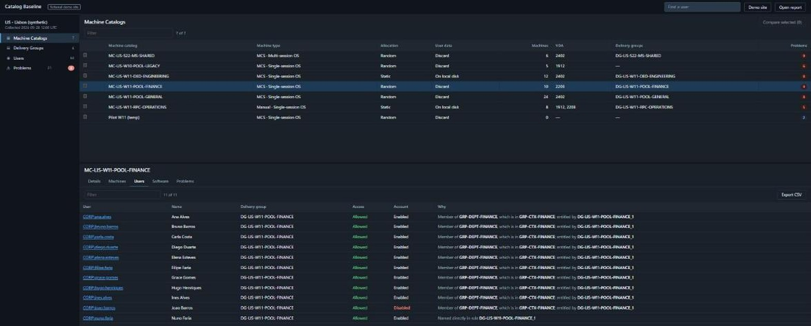

# Citrix Catalog Baseline

[](https://github.com/gandara-dev/citrix-catalog-baseline/actions/workflows/ci.yml)
[](https://learn.microsoft.com/powershell/)
[](LICENSE)

An access review for Citrix Virtual Apps and Desktops machine catalogs. For
every catalog it shows the machines, the software installed on them, and every
user who can start a desktop from it, with the exact path of groups and rules
that grants the access. Deterministic rules then point at what deserves a
second look: disabled accounts that still have access, the same application at
different versions across catalogs, persistent machines that drifted, VDAs out
of support, and more.

> Everything runs on your machine. The collector uses read-only Citrix and
> Active Directory calls, the report is a local file, and the page reads it in
> the browser without uploading it. The public demo is a fictional site.

**[Open the demo console](https://gandara-dev.github.io/citrix-catalog-baseline/)**



## Why

Studio answers "what is in this delivery group". An access review asks the
opposite questions: who can reach this catalog, through which group, and why
does this person reach three desktops that run the same software? The answers
are spread over entitlement, assignment, and access policy rules, nested AD
groups, and machine assignments. This project resolves them into one report you
can filter, compare, and export.

## How it works

```text
Get-CcbSiteSnapshot ──> site.snapshot.json ──> New-CcbReport ──> report.json ──> review page
 (Broker SDK, AD,         (optional:              (access paths,                   (filter, compare,
  WinRM, read only)        Protect-CcbSnapshot)    recommendations)                  user lookup, CSV)
```

- **Collector** (`Get-CcbSiteSnapshot`): reads catalogs, delivery groups,
  machines, and the entitlement, assignment, and access policy rules through
  the Citrix Broker PowerShell SDK; resolves the users and groups those rules
  name through the ActiveDirectory module, expanding nested groups; and reads
  installed software from the uninstall registry keys over PowerShell remoting.
  Pooled catalogs are inventoried from one machine (they share an image);
  persistent catalogs from every registered machine.
- **Pseudonymization** (`Protect-CcbSnapshot`): replaces users, groups,
  machines, and SIDs with stable codes when a snapshot has to be shared.
- **Analysis** (`Resolve-CcbAccess`, `Get-CcbRecommendation`, `New-CcbReport`):
  the only implementation of the access model and the rules, covered by Pester.
- **Console** (`site/`): a Studio-style view of `report.json`. A tree on the
  left (Machine Catalogs, Delivery Groups, Users, Problems), the list of objects
  on top, and a details pane with tabs for the selected one; every access is
  explained in plain words ("member of GRP-DEPT-FINANCE, which is in
  GRP-CTX-FINANCE; entitled by DG-LIS-W11-POOL-FINANCE_1"). It never
  recomputes access; it sorts, filters, compares, and exports to CSV.

## The access model

A user reaches a delivery group when both of these hold:

1. a **desktop rule** grants a desktop: an entitlement rule for shared
   desktops, or an assignment rule or a direct machine assignment for private
   desktops;
2. an **access policy rule** allows the connection.

Each rule matches through its included users minus its excluded users, with
nested groups expanded; a rule whose included-user filter is disabled matches
everyone. The report keeps three outcomes apart: `Granted`,
`BlockedByAccessPolicy` (a desktop is granted but no access rule lets the user
connect), and `DeliveryGroupDisabled`. The shortest membership chain is the
path shown for each user. See [docs/access-model.md](docs/access-model.md).

## Recommendations

| ID | Severity | Finds |
|---|---|---|
| CCB001 | High | Disabled accounts that can still start a desktop |
| CCB002 | Medium | Users named directly in a desktop rule instead of through a group |
| CCB003 | Low | Catalog pairs that share users and most of their software (consolidation candidates) |
| CCB004 | Medium | The same application at different versions across catalogs |
| CCB005 | Medium | Persistent machines whose software differs from the rest of their catalog |
| CCB006 | High | VDAs older than a minimum version (default 2203, since 1912 LTSR is out of support) |
| CCB007 | Low | Machines, or whole catalogs, that no delivery group uses |
| CCB008 | Low | Empty catalogs |
| CCB009 | Low | Private desktops not used for 60 days or more |
| CCB010 | Low | Access that depends on more than three levels of nested groups |
| CCB011 | Medium | Circular group nesting |
| CCB012 | Info | Users granted a desktop but blocked by the access policy |
| CCB013 | Info | Disabled delivery groups that still entitle users |
| CCB014 | Low | Catalogs, delivery groups, or machines outside your naming convention |

Every recommendation lists the evidence rows that triggered it and a suggested
action. The demo site follows an enterprise naming convention
(`MC-LIS-W11-POOL-FINANCE`, `DG-LIS-W11-DED-ENGINEERING`, `LISW11FIN001`);
pass your own as regular expressions for `CCB014`, see
[docs/naming-convention.md](docs/naming-convention.md). Thresholds are parameters. Details in
[docs/recommendations.md](docs/recommendations.md).

## Try it without a Citrix site

Requirements: PowerShell 7.2 or newer.

```powershell
git clone https://github.com/gandara-dev/citrix-catalog-baseline.git
cd citrix-catalog-baseline
./scripts/Invoke-CatalogReview.ps1 -Synthetic -OutputDirectory ./review
./scripts/Start-ReviewPage.ps1 -Open
```

The console opens the demo site; use **Open report** to load `./review/report.json`.

## Run it against a site

Run on a Delivery Controller, or on a management machine with the Citrix
PowerShell SDK and the RSAT Active Directory module:

```powershell
./scripts/Invoke-CatalogReview.ps1 -AdminAddress ddc01.corp.example.test -Verbose
```

Add `-Pseudonymize` before sharing the output, and `-SkipSoftware` when
PowerShell remoting to the VDAs is not allowed. Required rights:

- a Citrix administrator role that can read machine catalogs, delivery groups,
  and machines (a Read Only Administrator scoped to the site is enough);
- read access to the users and groups in Active Directory;
- for the software inventory only, PowerShell remoting to the VDAs.

The collector changes nothing. See [docs/operations-guide.md](docs/operations-guide.md).

## Test

```powershell
Install-Module Pester -RequiredVersion 5.7.1 -Scope CurrentUser -Force -SkipPublisherCheck
Invoke-Pester -Path ./tests -CI -Output Detailed
node --test tests/web/*.test.mjs
```

CI runs Pester on Windows and Linux, PSScriptAnalyzer, the page tests, and a
JSON Schema check of the sample snapshot. See [docs/testing.md](docs/testing.md).

## Documentation

- [Access model](docs/access-model.md)
- [Recommendations](docs/recommendations.md)
- [Naming convention](docs/naming-convention.md)
- [Data safety](docs/data-safety.md)
- [Operations guide](docs/operations-guide.md)
- [Testing guide](docs/testing.md)
- [Release verification](docs/release-verification.md)
- [Security policy](SECURITY.md)
- [Contributing](CONTRIBUTING.md)

## Current scope

Version `0.2.0` covers on-premises Citrix Virtual Apps and Desktops and
desktops only. It does not read Citrix Cloud (DaaS), published applications,
or application groups, and it does not evaluate the connection type
(`AllowedConnections`), SmartAccess tags, or client IP filters of access policy
rules: any enabled access rule that matches the user counts as allowing the
connection. These are explicit limits, not implicit promises.

## License

[PolyForm Shield 1.0.0](LICENSE). You may use, study, and modify this project,
including inside your organization, but not to offer a product that competes
with it. This is a source-available license, not an OSI-approved open-source
license.
